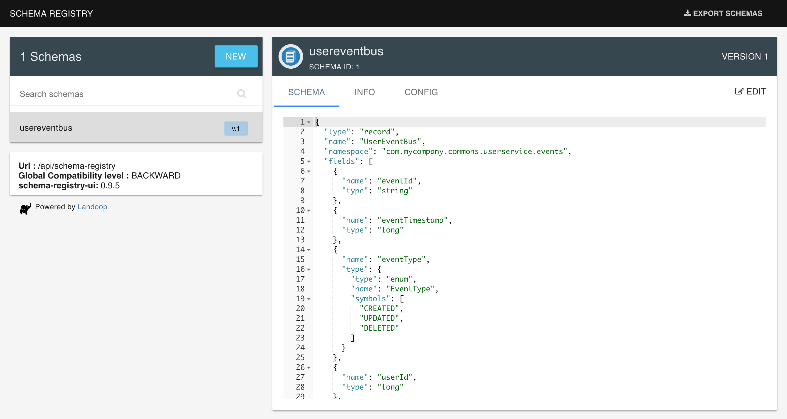

# springboot-kafka-mysql-cassandra

## Goal

The goal of this project is to create a service that handles _users_ using
[`Event Sourcing`](https://martinfowler.com/eaaDev/EventSourcing.html). So, besides the traditional create/update/delete,
whenever an user is created/updated/deleted an event (informing this change) is sent to [`Kafka`](https://kafka.apache.org).
Furthermore, we will implement a service that will listen for those events and save them in
[`Cassandra`](http://cassandra.apache.org).


## Microservices

- `user-service`: spring-boot application responsible for handling users (create/update/delete). The users information
will be stored in [`MySQL`](https://www.mysql.com). Once an user is created/updated/deleted, one event is sent
to `Kafka`;

- `event-service`: spring-boot application responsible for listening events from `Kafka` and saving those events in
`Cassandra`.

## Start Environment

### Docker Compose

1. Open a terminal

2. Inside `/springboot-kafka-mysql-cassandra` root folder run
```
docker-compose up -d
```
> To stop and remove containers, networks and volumes type:
> ```
> docker-compose down -v
> ```

3. Wait a little bit until all containers are `Up (healthy)`. You can check their status running
```
docker-compose ps
```
The output will be something like
```
Name              Command                          State          Ports
---------------------------------------------------------------------------------------------------------------
event-cassandra            docker-entrypoint.sh cassa ...   Up (healthy)   7000/tcp, 7001/tcp, 0.0.0.0:7199->7199/tcp, 0.0.0.0:9042->9042/tcp, 0.0.0.0:9160->9160/tcp
kafka                      /etc/confluent/docker/run        Up (healthy)   0.0.0.0:29092->29092/tcp, 9092/tcp
kafka-manager              /kafka-manager/bin/kafka-m ...   Up             0.0.0.0:9000->9000/tcp
kafka-rest-proxy           /etc/confluent/docker/run        Up (healthy)   0.0.0.0:8082->8082/tcp
kafka-schema-registry-ui   /run.sh                          Up (healthy)   0.0.0.0:8001->8000/tcp
kafka-topics-ui            /run.sh                          Up (healthy)   0.0.0.0:8085->8000/tcp
schema-registry            /etc/confluent/docker/run        Up (healthy)   0.0.0.0:8081->8081/tcp
user-mysql                 docker-entrypoint.sh mysqld      Up (healthy)   0.0.0.0:3306->3306/tcp, 33060/tcp
zipkin                     /bin/bash -c test -n "$STO ...   Up (healthy)   9410/tcp, 0.0.0.0:9411->9411/tcp
zookeeper                  /etc/confluent/docker/run        Up (healthy)   0.0.0.0:2181->2181/tcp, 2888/tcp, 3888/tcp
```

## user-service

### Serialization format 

We can use [`JSON`](https://www.json.org) (default) or [`Avro`](https://avro.apache.org) format to serialize
data to the `binary` format used by Kafka. If `Avro` format is chosen, both services will benefit by the
[`Schema Registry`](https://docs.confluent.io/current/schema-registry/docs/index.html) that is running as Docker container.

### Start service

1. Open a new terminal

2. Inside `/springboot-kafka-mysql-cassandra` root folder run

- **For `JSON` serialization**
```
./gradlew user-service:bootRun
```

- **For `Avro` serialization**
```
./gradlew user-service:bootRun -Dspring.profiles.active=avro
```

## event-service

### Deserialization

Differently from `user-service`, `event-service` has no specific profile to select the deserialization format.
Spring Cloud Stream provides a stack of `MessageConverters` that handle the conversion of many different types of
content-types, including `application/json`. Besides, as `event-service` has `SchemaRegistryClient` bean registered,
Spring Cloud Stream auto configures an Apache Avro message converter for schema management.

In order to handle different content-types, Spring Cloud Stream  has a "content-type negotiation and transformation"
strategy (https://docs.spring.io/spring-cloud-stream/docs/current/reference/htmlsingle/#content-type-management). The
precedence orders are: 1st, content-type present in the message header; 2nd content-type defined in the binding;
and finally, content-type is `application/json` (default).

The producer (in the case `user-service`) always sets the content-type in the message header. The content-type can be
`application/json` or `application/*+avro`, depending on with which profile `user-service` is started.

### Start service

1. Open a new terminal

2. Inside `/springboot-kafka-mysql-cassandra` root folder run
```
./gradlew event-service:bootRun
```

> Note: to re-generate Java class from Avro Schema run
> ```
> ./gradlew event-service:generateAvro
> ```

## How to test

1. Open `user-service` swagger link: http://localhost:9080/swagger-ui.html


2. Create a new user, `POST /api/users`

3. Open `event-service` swagger link: http://localhost:9081/swagger-ui.html


4. Get all events related to the user created, informing the user id `GET /api/events/users/{id}`

5. You can also check how the event was sent by `user-service` and listened by `event-service` (as shown on the image
below) using [`Zipkin`](https://zipkin.io): http://localhost:9411


6. Create new users and update/delete existing ones in order to see how the application works.

## Useful Commands & Links

### MySQL Database
```
docker exec -it user-mysql bash -c 'mysql -uroot -psecret'
use userdb;
select * from users;
```

### Cassandra Database
```
docker exec -it event-cassandra cqlsh
USE mycompany;
SELECT * FROM user_events; 
```

### Kafka Topics UI

- Kafka Topics UI can be accessed at http://localhost:8085


### Schema Registry UI

- Schema Registry UI can be accessed at http://localhost:8001



### Kafka Manager

1. Kafka Manager can be accessed at http://localhost:9000

2. First, you must create a new cluster. Click on `Cluster` (dropdown on the header) and then on `Add Cluster`

3. Type on `Cluster Name` field the name of your cluster, for example: `MyZooCluster`

4. On `Cluster Zookeeper Hosts` field type: `zookeeper:2181`

5. Click on `Save` button on the bottom of the page. Done!

6. The image below shows the topics present on Kafka, including the topic `com.mycompany.userservice.user` with `2`
partitions, that is used by the microservices of this project.


## TODO

- rename UserEventBus by UserEventMessage; 
- use testcontainers to run Cassandra and Kafka/Zookeeper;
- implement tests to validate sending/receiving messages to/from Kafka;
- update spring-cloud-stream version to Greenwich.RELEASE.

## References

- https://docs.spring.io/spring-cloud-stream/docs/current/reference/htmlsingle/
